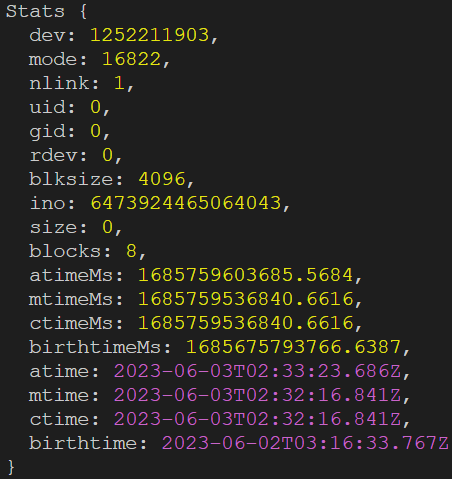

## 1. 什么是Node.js

`Node.js` 是一个**跨平台**的`JavaScript` 运行环境，是一款应用程序，可以运行`JavaScript` 

`Node.js` 的作用：

- 开发服务器应用
- 开发工具类应用
- 开发桌面应用

Node运行JavaScript程序

```shell
node app.js
```

## 2. 基本知识

#### 2.1 Buffer的学习

Buffer的创建：

- alloc()：

  ```js
  // 10为Buffer的长度
  let buf = Buffer.alloc(10)
  ```

  

- allocUnsafe()

  ```js
  // 该方法为alloc的不安全版，特点是可能会包含旧的内存数据
  let buf = Buffer.allocUnsafe(10)
  ```

- from()

  ```js
  // 会把参数数据转换为Buffer
  let buf = Buffer.from('hello')
  ```

## 3. fs模块

Node.js提供了一种`文件系统`模块：fs，提供了对文件的读和写的操作方法

#### 3.1 写入文件

- **`fs.wirteFile()`**方法

  **是异步的操作**

  语法：
  
  ```js
  fs.writeFile(filename, data[, options], callback)
  ```
  
  该方法有四个参数：
  
  - file：写入的文件名
  - data：要写入的数据，可以是**String字符串**或**Buffer缓冲对象**
  - option：该参数是一个对象，包含 {encoding, mode, flag}。默认编码为 utf8, 模式为 0666 ， flag 为 'w'
  - callback：是一个回调函数，只包含错误信息，当写入失败时返回 
  
  ```js
  // 通过require导入'fs'模块
  const fs = require('fs');
  // 会生成一个'ikun.txt'文件，里面内容为：你干嘛！嗨哟~
  fs.writeFile('./ikun.txt','你干嘛！嗨哟~',err=>{
    if(err){
      console.log('出错嘞！')
    }
    console.log('成功嘞！');
    ;
  })
  ```
  
- **`fs.writeFileSync()`**方法

  **是同步版的`writeFile()`**，少了错误时的回调

  语法：

  ```js
  fs.wirteFile(filename, [, options])
  ```

  参数：

  - file：写入的文件名
  - data：要写入的数据，可以是**String字符串**或**Buffer缓冲对象**
  - option：该参数是一个对象，包含 {encoding, mode, flag}。默认编码为 utf8, 模式为 0666 ， flag 为 'w'

#### 3.2 追加写入

- **`fs.appendFile()`**方法

  作用：向已存在的文件中的内容的尾部添加内容

  语法：

  ```js
  fs.appendFile(filename, data[, options], callback)
  ```

  参数：

  - file：写入的文件名
  - data：要写入的数据，可以是**String字符串**或**Buffer缓冲对象**
  - option：该参数是一个对象，包含 {encoding, mode, flag}。默认编码为 utf8, 模式为 0666 ， flag 为 'w'
  - callback：是一个回调函数，只包含错误信息，当写入失败时返回 

  ```js
  const fs = require('fs')
  // 会在内容末尾加上‘我是ikun’
  fs.appendFile('ikun.txt', '我是ikun', err => {
    if (err) {
      console.log('错误啦')
    }
    console.log('成功啦')
  })
  ```

  

- **`fs.appendFileSync()`**方法

  **是同步版的`writeFile()`**，少了错误时的回调

  语法：

  ```js
  fs.appendFileSync(filename, [, options])
  ```

  参数：

  - file：写入的文件名
  - data：要写入的数据，可以是**String字符串**或**Buffer缓冲对象**
  - option：该参数是一个对象，包含 {encoding, mode, flag}。默认编码为 utf8, 模式为 0666 ， flag 为 'w'

#### 3.3 流式写入

- **`fs.createWriteStream()`**方法

  作用：该方法也是向文件写入内容

  特点：是向文件之间创建了流通道，减少了打开、关闭文件的次数，流式写入适合**大文件写入**和**频繁的写入**

  语法：

  ```js
  	fs.createWriteStream(path[, options])
  ```

  参数：

  - path：要建立流的文件的路径
  - option：

  ```js
  const fs = require('fs')
  // 创建文件流
  const ws = fs.createWriteStream('ikun.txt')
  // 使用 .write 方法写入内容
  ws.write('蔡徐坤容颜赏心悦目是ikun信仰')
  // 关闭文件流（可选）
  ws.close()
  ```

#### 3.4 文件读取

- **`fs.readFile()`**方法

  作用：读取指定文件的内容，固定以Buffer形式输出

  语法：

  ```js
  fs.readFile(path[,option],callback)
  ```

  参数：

  - path：要读取的文件路径
  - options：选项配置
  - callback：回调函数，其中有两个参数（err,data），err为读取错误返回的信息，data为读取成功获得的数据

  ```js
  const fs = require('fs')
  
  fs.readFile('./ikun.txt', (err, data) => {
  
   if (err) {
    console.log('出错嘞')
   }
   // 由于返回读取的信息为Buffer，所以使用toString来转成字符串
   console.log(data.toString())
  })
  ```

- **`fs.readFileSync()`**方法

  **是同步版本的`fs.readFile()`**

  语法：

  ```js
  fs.readFileSync(filename[, options])
  ```

#### 3.5 流式读取

- **`fs.createReadStream()`**方法

  语法：

  ```js
  	fs.createReadStream(path[, options])
  ```

  参数：

  - path：创建读取流的文件的路径
  - options：选项配置

  ```js
  const fs = require('fs')
  // 创建读取流
  const rs = fs.createReadStream('./ikun.txt')
  // 
  rs.on('data',chunk=>{
    console.log(chunk.toString());
  })
  // 在进行完读取操作后执行的函数
  rs.on('end',()=>{
      xxxxx
  })
        
  ```
  

#### 3.6 文件的重命名和移动

- **`fs.rename()`**方法

  作用：实现文件的重命名，也可以移动文件

  语法：

  ```js
  fs.rename(oldPath, newPath, callback)
  ```

  参数：

  - oldPath：文件当前的路径（当前的文件名）
  - newPath：将要移动或重命名的路径
  - callback：返回错误信息的回调函数

  ```js
  const fs = require('fs')
  // 原来当前文件目录下的'hello'文件被改名为'fuck'，并被移动到上一级目录下了
  fs.rename('./hello.txt','../fuck.txt',err=>{
    console.log('出错啦');
  })
  ```

- **`fs.renameSync()`**方法

  `fs.rename()`方法的同步版本

  少了callback回调函数

#### 3.7 文件删除

- **`fs.unlink()`**方法

  作用：删除指定文件

  语法：

  ```js
  fs.unlink(path, callback)
  ```

  参数：

  - path：指定文件的路径
  - callback：返回错误信息回调

​	**fs.unlinkSync(path)**为同步版，没有错误回调函数

- **`fs.rm`**方法

  具体语法和参数跟**fs.unlink()**一样

  ```js
  const fs = require('fs')
  
  fs.unlink('../fuck.txt',err=>{
    if(err){
      console.log('出错了');
    }
    console.log('删除成功');
  })
  ```

  

#### 3.8 文件夹操作

- **`fs.mkdir()`**方法

  作用：创建文件夹

  参数：

  - path：文件夹路径
  - options：选项配置（可选）
  - callback：操作后回调，参数为失败信息

  **fs.mkdirSync(path)**为同步版，没有错误回调函数

  ```js
  const fs = require('fs')
  // 创建'html'文件夹
  fs.mkdir('../html',err=>{
    if(err){
      console.log('出错了');
    }
    console.log('删除成功');
  })
  ```

  

- **`fs.readdir()`**方法

  作用：读取文件夹的内容

  参数：

  - path：读取文件的路径
  - options：选项配置（可选）
  - callback：操作完成后的回调

  **fs.readdirSync(path)**为同步版，没有错误回调函数

  ```js
  fs.readdir('../html', (err,data) => {
    if (err) {
      console.log('出错了')
    }
    console.log('读取成功')
    console.log(data);
  })
  ```

- **`fs.rmdir()`**方法

  作用：删除文件夹

  参数：

  - path：指定文件夹的路径
  - options：选项配置（可选）
  - callback：操作完成后的回调

  **fs.rmdirSync(path)**为同步版，没有错误回调函数

  ```js
  fs.rmdir('../html', err => {
    if (err) {
      console.log('出错了')
    } else {
      console.log('删除成功')
    }
  })
  ```

  **注意**：当文件夹是**非空**的情况下，无法直接删除

  解决：设置选项为：`{recursive:true}`

  ```js
  fs.rmdir('../html',{recursive:true}, err => {
    if (err) {
      console.log('出错了')
    } else {
      console.log('删除成功')
    }
  })
  ```

#### 3.9 查看资源信息

- **`fs.stat()`**方法

  作用：查看指定资源的状态

  参数：

  - path：指定资源的路径
  - callback：操作完成后的回调

  ```js
  const fs = require('fs')
  
  fs.stat('../fs模块',(err,data)=>{
    if(err){
      console.log('出错嘞！');
      return
    }
    console.log(data);
  })
  ```

  结果如图：

  

## 4. path模块

path模块负责处理路径这一块的问题，有一些常用的方法，可以有效处理并拿到路径的相关信息

| API           | 作用                     |
| ------------- | ------------------------ |
| path.resolve  | 拼接规范的绝对路径       |
| path.sep      | 获取操作系统的路径分隔符 |
| path.parse    | 解析路径并返回一个对象   |
| path.basename | 获取路径的基本名称       |
| path.dirname  | 获取路径的目录名         |
| path.extname  | 获取路径的扩展名         |

- `__dirname`：可以用来动态获取当前文件所属**目录**的绝对路径
- `__filename`：可以用来动态获取**当前文件**的绝对路径，包含当前文件

## 5. HTTP协议

HTTP 协议指 `HyperText Transfer Protocol`（超文本传输协议）

#### 5.1 HTTP请求报文的结构

HTTP请求报文有三个部分组成：

1. 请求行

   请求行部分由三个部分组成：

   - 请求方法

     | 方法      | 作用         |
     | --------- | ------------ |
     | GET       | 用于获取数据 |
     | POST      | 用于新增数据 |
     | PUT/PATCH | 用于更新数据 |
     | DELETE    | 用于删除数据 |

     

   - URL

     URL是**统一资源定位器**（Uniform Resource Locators）

     作用：用于定位要请求的资源

   - HTTP版本号

2. 请求头

   HTTP的报文头，报文头包含若干个属性，格式为“属性名:属性值”，服务端据此获取客户端的信息。与缓存相关的规则信息，均包含在 header 中，请求头可大致分为四种类型：通用首部字段、请求首部字段、响应首部字段、实体首部字段。这里先简单罗列，稍后做具体解释。

3. 请求体

   请求体就是 HTTP 要传输的内容，HTTP 可以承载很多类型的数字数据:图片、音频、视频、HTML 文档等

#### 5.2 HTTP响应报文的结构

1. 响应行

   包含三个部分：

   - HTTP版本号

   - 响应状态码：

     状态码的分类

     | 状态码         | 含义           |
     | -------------- | -------------- |
     | 1XX(以1开头的) | 信息响应       |
     | 2XX(以2开头)   | 成功响应       |
     | 3XX(以3开头)   | 重定向消息     |
     | 4XX(以4开头)   | 客户头错误响应 |
     | 5XX (以5开头)  | 服务端错误响应 |

     常见的状态码有

     | 状态码 | 含义           |
     | ------ | -------------- |
     | 200    | 请求成功       |
     | 403    | 禁止请求       |
     | 404    | 找不到资源     |
     | 500    | 服务器内部错误 |

   - 响应的状态描述

2. 响应头

   记录了与服务器、响应体相关的内容

3. 响应体

   常见的响应体内容，返回给请求前端

   - html
   - css
   - js
   - 图片
   - json
   - 视频

#### 5.3 IP地址

作用：用来在网络上标识一台主机

分类：

- 本机回环IP地址
- 局域网IP（私网IP）
- 广域网IP（公网IP）

#### 5.4 端口

端口是不同**应用程序**的标识

作用：实现不同主机应用程序之间的通信

#### 5.5  创建http服务器

```js
// 引入http模块
const http = require('http')
// 创建服务器
const server = http.createServer((request,response)=>{
    // 设置请求头的编码为utf8，防止浏览器接收乱码
  response.setHeader('content-type','text/html;charset=utf-8')
    // 设置响应体
  response.end('hello http sever')
})
// 启动服务器端口为9000，第二个参数为启动成功后的回调
server.listen(9000,()=>{
  console.log('服务启动成功。。。。');
})
```

#### 5.6 获取HTTP请求报文

```js
const server = http.createServer((request, response) => {
  // 设置请求头的编码为utf8，防止浏览器接收乱码
  response.setHeader('content-type','text/html;charset=utf-8')
  response.end('你好')
  // 1. 获取请求方法
  console.log('请求方法：',request.method);
  // 2. 获取请求的url
  console.log('请求的url: ',request.url);
  // 3. 获取HTTP协议版本号
  console.log('协议版本号：',request.httpVersion);
  // 4. 获取HTTP 请求头
  console.log('请求头：',request.headers);
})
```

##### 5.6.1 获取请求体

**注意**：请求方法为GET时，请求体为空。所以拿不到数据，请求方法为POST可以

```js
const server = http.createServer((request, response) => {
  // 设置请求头的编码为utf8，防止浏览器接收乱码
  response.setHeader('content-type', 'text/html;charset=utf-8')
  response.end('你好')
  // 设置body接收响应体
  let body = ''
  // on 绑定'data'事件，chunk为接收到的结果回调
  request.on('data', chunk => {
    // 赋值给body
    body += chunk
  })
  //  绑定'end'事件，在获取响应体成功后输出
  request.on('end',()=>{
    console.log(body);
  }
  )
})
```

##### 5.6.2 获取请求URL

```js
// 导入url模块
const url = require('url')
const server = http.createServer((request, response) => {
  // 设置请求头的编码为utf8，防止浏览器接收乱码
  response.setHeader('content-type', 'text/html;charset=utf-8')
  response.end('url')
  // 解析request.url
  let res = url.parse(request.url) 
  // 获取路径
  console.log(res.pathname);
})
```

```js
// 导入url模块
const server = http.createServer((request, response) => {
  // 设置请求头的编码为utf8，防止浏览器接收乱码
  response.setHeader('content-type', 'text/html;charset=utf-8')
  response.end('url')
  // 解析request.url
  let res = new URL(request.url,'http://127.0.0.1') 
  // 'http://127.0.0.1' 是服务器的base地址
  // 获取路径
  console.log(res.pathname);
})
```

#### 5.7 设置HTTP响应报文

```js
const server = http.createServer((request, response) => {
  	// 1. 设置响应状态码
  	response.statusCode = 200
  	// 2. 设置响应状态描述
  	response.statusMessage = 'success'
  	// 3. 设置响应头
  	response.setHeader('content-type','text/html;charset=utf-8');      		
    response.setHeader('Server','Node.js');
 	response.setHeader('myHeader','xxxx')
    // 4. 设置响应体
    response.write('xxx')
    // 或者使用end
    response.end('xxx')
    // write和end选一个
})
```

## 6. Node.js模块化

**定义：**将一个复杂的程序文件依据一些规则拆分成多个文件的过程为`模块化` 

**特点：**模块的内部数据是私有的，只有当暴露出去时，其他模块才能获取

**好处：**

- 防止命名冲突
- 高复用性
- 高维护性

#### 6.1 暴露模块

1. `module.exports`方法

   该方法可以暴露任何数据

   1. 单个暴露

   ```js
   // 定义一个方法
   function hello(){
       console.log('hello')
   }
   // 暴露该方法
   module.exports = hello
   ```

   2. 对象形式暴露

   ```js
   // 定义多个方法
   function hello(){
       console.log('hello')
   }
   function fuck(){
       console.log('fuck')
   }
   // 暴露该方法
   module.exports = {
       hello,
       fuck
   }
   ```

   

2. `exports`方法

   ```js
   // 定义一个方法
   function hello(){
       console.log('hello')
   }
   // 暴露该方法
   exports.hello = hello
   
   //如果是多个方法，就只能依次暴露
   exports.xxx = xxx
   ```


#### 6.2 导入模块

导入模块的基本语法：

```js
const test = require('./xxx')
```

注意：

1. 对于导入自己创建的模块，导入时建议写`相对路径`，且不能省略`./`和`../`
2. 导入`js`和`json`文件不需要写后缀
3. 导入其他类型的文件，会以`js`文件处理
4. 导入`Node.js`内置模块直接写名字，例如`fs`、`url`

#### 6.3 require导入模块的基本流程

1. 将相对路径转换为绝对路径
2. 缓存检测
3. 读取目标文件代码
4. 包裹为一个函数并执行（自执行函数）
5. 把模块的值进行缓存
6. 返回`module.export`的值

## 7. 包管理工具

- **包**是一组特定功能的**源码的合集**

- **包管理工具**是管理包的应用软件，对`包`进行`下载安装`、`更新`、`删除`、`上传`等操作

常用的包管理工具有：

- npm
- yarn
- cnpm

#### 7.1 npm

1. 初始化包

   ```shell
   npm init
   ```

   使用该命令创建`package.json`文件

   ````shell
   npm init -y
   ````

   使用该命令**快速**创建`package.json`文件（文件的属性值全部是默认值）

   创建好的文件内容如下

   ```json
   {
     "name": "npm_test",  // 包的名字
     "version": "1.0.0",  // 包的版本
     "description": "npm first test!!", // 包的描述
     "main": "index.js",   // 包的入口文件
     "scripts": {        // 脚本配置
       "test": "echo \"Error: no test specified\" && exit 1"
     },
     "author": "",  // 作者
     "license": "ISC" // 开源证书
   }
   ```

   注意：

   - 包名不能是`中文`或者`大写字母`，创建的`package.json`文件所在的文件名要求也是如此

2. npm搜索

   在 [npm官网](https://www.npmjs.com/) 去搜索需要的包

3. 下载安装包

   ```shell
   npm install 包名
   // 或者
   npm i 包名
   ```

   在下载了包后，文件夹下会新增两个文件：

   - `node_modules` 文件夹：用来存放下载的包文件
   
   - `package-lock.json`文件：用来锁定包的版本
   
     
   

- **npm install   -s **相当于 **npm install -S** 相当于 **npm install --save**

  这样安装是局部安装的，会写进package.json文件中的dependencie里，是**生产环境**

- **npm install   -d **相当于 **npm install -S** 相当于 **npm install --save-dev**

  这样安装是局部安装的，会写进package.json文件中的devDependencies 里，是**开发环境**

- **npm install   -g** 表示全局安装，安装一次过后，你就可以在其他直接用啦。

#### 7.2 yarn

yarn的特点：

- 速度快：yarn会缓存下载过的包，再次使用时无需重复下载
- 超级安全：在代码执行前，会验证每个安装包的完整性
- 超级可靠：使用详细、简介的锁文件格式和明确的安装算法，确保能在不同的系统上无差异工作

安装`yarn`

```shell
npm i -g yarn
```

yarn的常用命令

| 功能         | 命令                       |
| ------------ | -------------------------- |
| 初始化       | yarn init                  |
| 安装包       | yarn add  xxx              |
| 删除包       | yarn remove xxx            |
| 安装项目依赖 | yarn  #等同于 yarn install |
| 运行命令别名 | yarn <别名>                |

**注意**：

- 使用yarn全局安装前需要配置环境变量

- yarn也可以配置淘宝镜像

  ```shell
  yarn config set registry http://registry.npmmirror.com/
  ```


## 8. Express框架

express初体验

```js
const express = require('express')

const app = express()
// 当浏览器使用get方法发请求路径为‘/home’的请求时响应
app.get('/home',(req,res)=>{
  res.setHeader('content-type','text/html;charset=utf-8')
  res.end('hello world')
})

app.listen(9000,()=>{
  console.log('服务启动成功。。。。，端口为9000');
})
```

#### 8.1 express路由

> 路由确定了应用程序如何响应客户端对特定端点的请求

路由的使用如下：

```js
app.<method>(path,callback)
```

> method：请求方法
>
> path：请求路径
>
> callback：回调函数

#### 8.2 获取请求报文参数

```js
const express = require('express')

const app = express()
// 当浏览器使用get方法发请求路径为‘/home’的请求时响应
app.get('/home',(req,res)=>{
  res.setHeader('content-type','text/html;charset=utf-8')
  // 和http原生操作一样
  req.method
  res.url
  req.httpVersion
  req.headers
  // express封装的
  req.path //请求路径
  req.query //请求参数
  req.ip // 请求的ip地址
  req.get('xxxx') //获取请求体中的 ‘xxx’  
    
  res.end('hello world')
})

app.listen(9000,()=>{
  console.log('服务启动成功。。。。，端口为9000');
})
```

#### 8.3 获取路由参数

```js
const express = require('express')

const app = express()
// 当浏览器使用get方法发请求路径为‘/home’的请求时响应
app.get('/home',(req,res)=>{
  res.setHeader('content-type','text/html;charset=utf-8')
  // req.params 是专门存储路由参数的
  req.params.id 
  res.end('hello world')
})

app.listen(9000,()=>{
  console.log('服务启动成功。。。。，端口为9000');
})
```

#### 8.4 设置响应报文

```js
const express = require('express')

const app = express()
// 当浏览器使用get方法发请求路径为‘/home’的请求时响应
app.get('/home',(req,res)=>{
  res.setHeader('content-type','text/html;charset=utf-8')
  
  // express封装方法
  res.status(500) // 响应状态码
  res.set('aaa','bbb') // 响应头
  res.send('hello exporess') // 响应体
})

app.listen(9000,()=>{
  console.log('服务启动成功。。。。，端口为9000');
})
```

#### 8.5 获取请求体

express框架获取请求体需要使用插件`body-parser`

```shell
npm i body-parser
```

> `body-parser`是一个中间件，可以设置为**全局中间件**、路由中间件

```js
const express = require('express')
// 1. 导入
const bodyParser = require('body-parser')
const app = express()

// 2. 设置中间件
const jsonParser = bodyParser.json() // 处理json格式的请求体的中间件
const urlencodeParser = bodyParser.urlencode({extend: false}) // 处理string格式的请求体的中间件

// 3. 使用中间件
app.get('/home',urlencodeParser,(req,res))=>{
    // 获取请求体
    req.body
}
```

> 在执行完中间件后，会给req上添加一个body属性，也就是请求体

#### 8.6 express中间件

**中间件**（Middleware）是一个回调函数

**作用：**封装公共操作，简化代码

**分类：**

1. 全局中间件
2. 路由中间件
2. 静态资源中间件

**使用**：

1. **全局中间件**

```js
const express = require('express')

const app = express()
function recordMiddleware(req,res,next){
    .....
    next()
}
// 全局使用中间件
app.use(recordMiddleware)
```

> 中间件函数有三个参数：
>
> 1. req：请求报文
> 2. res：响应报文
> 3. next：放行函数，在执行完中间件函数时，通知各个部分执行自己后续操作

当`app.use()`使用了中间件函数时，每一个路由在接收请求后都会调用该函数做相同的事情，就体现了**"封装公共操作，简化代码"**

2. **路由中间件**

```js
let checkCodeMiddleware = (req,res,next)=> {
    ....
    next()
}

// 在想要使用该函数的路由中使用
app.get('/home',checkCodeMiddleware,(req,res))=>{
    res.send('xxx')
}
```

这样只对引入了中间件的路由起作用，当有请求进来时，会先经过中间件函数，等到`next()`后，才会执行后续响应操作

3. **静态资源中间件**

```js
const express = require('express')
const app = express()

app.use(express.static(__dirname + '/xxx'))
```

> express.static()是一个方法，参数是静态资源的父级目录路径，设置该中间件后，在请求路径中直接输入静态资源相对路径即可在浏览器获取静态资源

#### 8.7 防盗链

> **“防盗链”**意思是对本服务器资源进行特殊处理，使得其他网站不能请求本服务器的资源

**实现思路**：在请求头中有一个`refer`字段，记录请求的网站地址，通过判断是否为本服务器的地址，来决定是否返回资源

```js
const express = require('express')

const app = express()
// 设置中间件
app.use((req,res,next){
    // 获取请求头中的refer
    let refer = req.get('refer')
	if(refer){
        let url = new Url(refer)
        // 获取主机地址
        let hostname = url.hostname
        // 不等于则返回404
        if(hostname != '本机地址'){
            res.status(404)
            res.send('404 ERROE')
            return
        }
    }
    next()
})
```

#### 8.8 路由模块化

> 使用express.Router对象，在局部模块文件中创建路由，主文件引入使用

1. **homeRouter.js**

```js
const express = require('express')
const router = express.Router()

router.get('/home',(req,res)) =>{
    res.send('xxx')
}
// 暴露模块
module.exports = router
```

2. **index.js**

```js
const express = require('express')
const homeRouter = require('./xx/homeRouter.js')
const app = express()

// 以中间件的方式使用模块路由
app.use(homeRouter)
```

#### 8.9 EJS模板引擎

> **模板引擎**是分离 用户界面 和 业务数据 的一种技术

> **EJS**是一个高效的JavaScript的模板引擎

下载EJS

```shell
npm i ejs --save
```

基本使用

```js
// 1. 引入
const ejs = require('ejs')
// 2. 调用render()
let result = ejs.render(`
<% xxx =%>
`)
```

> 被 `<% =%>`标签所包裹的区域写的是js代码，切有js代码的每一行都要加上该标签

1. EJS列表渲染

```js
const ejs = require('ejs')

const book = ['西游记','三国演义','水浒传','红楼梦']
// 调用render方法
let reslut = ejs.render(`
	<ul>
		<% book.forEach(item => { =%>
		<li><% item =%></li>
		<% }) =%>
	</ul>
`)
console.log(result) //输出的到有文本值的html文档
```

2. EJS条件渲染

```js
const ejs = require('ejs')

let flag = true

const book = ['西游记','三国演义','水浒传','红楼梦']
// 调用render方法
let reslut = ejs.render(`
	<% if(flag){ =%>
		<h1>小明</h1>
	<% }else{ =%>
		<h1>小洪</h1>
	<% } =%>
`)
console.log(result) //输出的到有文本值的html文档
```

**在express中使用EJS**

1. 创建模板文件 home.ejs

```ejs
<!DOCTYPE html>
<html lang="en">
<head>
  <meta charset="UTF-8">
  <meta name="viewport" content="width=device-width, initial-scale=1.0">
  <title>Document</title>
</head>
<body>
  <ul>
      <% book.forEach(item => { =%>
      <li><% item =%></li>
      <% }) =%>
  </ul>
</body>
</html>
```

2. 在index.js中使用

```js
const express = require('express')
const path = require('path')
const ejs = require('ejs')

const app = express()
// 设置模板引擎
app.set('views engine','ejs')
// 设置模板文件存放的位置 ==> .ejs文件
app.set('views',path.resolve(__dirname,'./xxx'))

app.get('/home',(req,res))=>{
    //在路由中使用
    let book = ['西游记','三国演义','水浒传','红楼梦']
    // res.render('文件名','文件中使用到的数据')
    res.render('home',{book})
}

app.listen(9000,()=>{
  console.log('服务启动成功。。。。，端口为9000');
})
```

## 9 会话控制

#### 9.1 基本技术

1. **cookie**

   > cookie 是保存在`浏览器端`的一小块数据

   **特点**：浏览器在向服务器发请求时，会自动将`当前域名下`可用的cookie设置在请求头中，发送给服务器

   **步骤**：

   1. 在用户首次向服务器进行身份校验时，发送用户名和密码等信息
   2. 服务器完成校验后，在响应头中返回`Set-Cookie`字段给浏览器
   3. 浏览器拿到`Set-Cookie`后，存储为cookie
   4. 往后每次用户向服务器发请求，都会携带cookie，以便服务器识别用户

2. **session**

   > session 是保存在`服务器端`的一小块数据，保存当前访问者的信息

   **作用**：实现会话控制，识别用户身份，快速获取当前用户的相关信息

   **步骤**：

   1. 服务器校验用户信息通过后，创建`session 信息`，将`session_id`通过放在`Set-Cookie`中返回给浏览器
   2. 浏览器存储cookie，往后请求携带cookie，服务器拿到cookie，从中获取`session_id`以确定用户身份

3. **token**

   > token 是在服务端生成返回给HTTP客户端的**一串加密字符串**，存储着用户信息

   **作用**：实现会话控制，可用识别用户身份

   **步骤**：

   1. 在用户首次向服务器进行身份校验时，发送用户名和密码等信息
   2. 服务器完成校验后，在响应头中返回`Token`字段给客户端
   3. 往后每次用户向服务器发请求，**需要手动携带Token**，以便服务器识别用户

   **特点**：

   | 特点         | 解释                                                |
   | ------------ | --------------------------------------------------- |
   | 服务器压力小 | 数据存储在客户端                                    |
   | 相对更安全   | 数据加密<br />可用避免CSRF（跨站请求伪造）          |
   | 扩展性强     | 一个Token多个服务间可以共享<br />增加服务节点更简单 |

4. **JWT（JSON Web Token）**

   > JWT 是目前最流行的**跨域认证解决方案**，可用在基于`token`的身份校验上，使得`token`的生成于与校验更规范

   **步骤**：

   1. 下载`jsonwebtoken`

      ```shell
      npm i jsonwebtoken
      ```

   2. 使用

      ```js
      const jwt = require('jsonwebtoken')
      
      // 创建生成token
      //jwt.sign(用户数据,加密字符串,配置对象)
      let token = jwt.sign({
          username:lxl
      },'nba2k23',{
          // 设置token生命周期
          expiresIn:60 //60秒
      })
      
      // 校验token
      let t = 'xxxxx' // 假设是客户端发来的token
      jwt.verify(t,'nba2k23',(err,data)=>{
          if(err){
              console.log('校验失败')
          }
          // data就是token里携带的用户信息
          console.log(data)
      })
      ```

      

#### 9.2 session 和 cookie 的区别

|            | session                                                | cookie                                         |
| ---------- | ------------------------------------------------------ | ---------------------------------------------- |
| 存放位置   | 服务端                                                 | 浏览器端                                       |
| 安全性     | 存放与服务端，安全性相对较好                           | 以明文方式存放于客户端，安全性相对较低         |
| 网络传输量 | 数据存储在服务器，只是通过cookie传递id，不影响传输效率 | cookie内容设置过多会增大报文体积，影响传输效率 |
| 存储限制   | 浏览器cookie存储不能超过`4KB`                          | session在服务器中没有限制                      |

