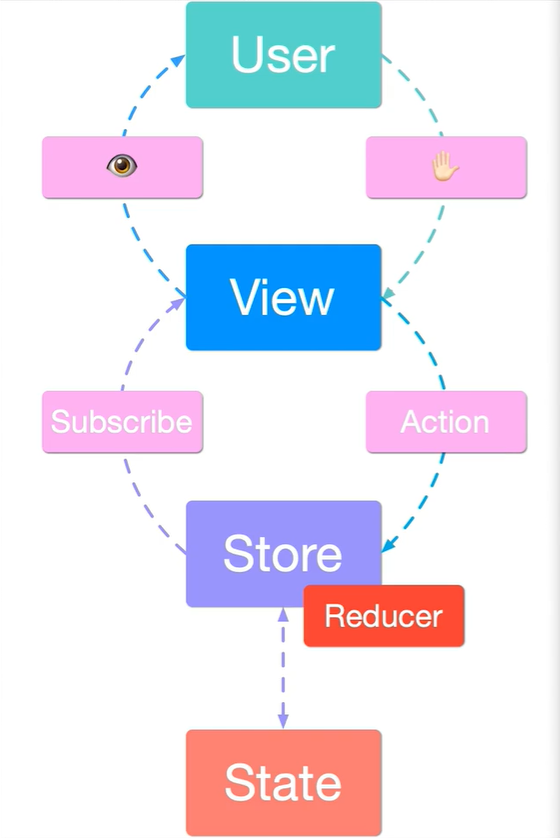

## 什么是React  

React 是一个用于构建用户界面的 JAVASCRIPT 库,主要用于构建 UI，很多人认为 React 是 MVC 中的 V（视图）  

## 1 react项目的基本创建    

使用`react脚手架`创建项目

```   shell
npx create-react-app my-app
```

```shell
> cd my-app
> npm start //启动项目
```


其中 `my-app` 项目名称，而 `create-react-app` 是 `react` 的构建工具

## 2 JSX介绍  

介绍：JSX是 `Javascript XML` 的缩写，就是在JS代码中写HTML结构，使用JSX在 `react` 项目中编写UI界面  

### 2.1 JSX中使用表达式

语法：`{JS表达式}`

```  js
const name = '梨花'  
<h1>你好，我叫{name} </h1>
```

**表达式可用**：  

- JS的基本数据类型
- 方法fn()

### 2.2 JSX列表渲染  

语法：使用数组的`map()`方法进行遍历，也需要填写key，以增加diff算法的效率，key仅仅在代码内部使用，不会出现在真实dom结构

```js
const songs = [
  {id:1,name:'离开地球表面'},
  {id:2, name: '天真有邪' },
  {id:3, name: '不要滚' }
]
```

在UI结构列表中使用`Array.map`进行遍历

```  JSX
<ul>
   {/*songs为列表源数据，song为map方法的形参*/}
   {songs.map(song =><li key={song.id}>{song.name}</li>)}
</ul>
```

### 2.3 条件渲染

1. `if-else` 条件渲染

   ```jsx
   const load = false
   const loadData = () => {
     if (load)
       return <h1>Loading.....</h1>
     else
       return <h1> 正在加载。。。。 </h1>
   }
   ```

   

2. 三元表达式（常用）：boolean ？a ：b

   ```jsx
   const load = true
   const loadData = () => {
     return load ? (<h1>Loading.....</h1>) : (<h1> 正在加载。。。。 </h1>)
   }
   ```

   

3. `&&` ：当`&&`前面布尔值为`true`才会渲染

   ```jsx
   const load = true
   const loadData = () => {
     // && 方法
     return load && <h1>Loading.....</h1>
   }
   ```

   

### 2.4 JSX使用样式

**行内样式**：

- 写法1:

  ```jsx
  // 表达式内以对象的形式写CSS
  <span style={{color:red}}></span>
  ```

  

- 写法2：

  ```jsx
  const style = {
      color:red
  }
  <span style = {style}></span>
  ```

    

**外联样式**：使用的是className属性

```jsx
<span className=''>hello world</span>
```

## 3 React组件

### 3.1 函数组件

**现在官方更推荐写函数式组件！！！**

注意事项：

- **组件名名称必须首字母大写**
- 必须要由返回值，返回UI结构
- 函数组件为**无状态组件**，只负责静态展示数据

```jsx
export default function Hello(){
	return <div>hello world!</div>
}
```

### 3.2 类组件

注意事项：

- **类名必须以大写字母开头**
- 类组件严格继承 `React.Component` 父类**（需要引入：“import React from 'react'”）**
- 类组件必须提供 `render` 方法，且必须有返回值，返回UI结构
- 类组件为**有状态组件**负责更新UI界面

```jsx
class Hello extends React.Component{
    render(){
        return <div>hello world!</div>
    }
}
```

### 3.3 抽离成一个单独的js文件  

React中单独的组件是一个单独的 `js文件` 

步骤：

1. 创建 `xxx.jsx` 组件
1. 在 `xxx.jsx` 中导入 `React` （import React form 'react'）
1. 创建组件（函数组件 或 类组件）
1. 通过 `export default` 导出 `xxx` 组件
1. 在 `index.js` 中通过 `import` 导入组件
1. 渲染组件

### 3.4 组件间通信  

1. **组件的props（父组件向子组件传递）**

   props的作用：用于接收传递给组件的参数

   用法：

   1. 在子组件标签中给标签添加属性(假设组件名为`Hello`)

      ```jsx
      <Hello name="Tom" age={19}></Hello>
      ```

   2. 接收数据：

      1. 如果是函数组件，那么props作为函数参数接收，然后在方法内部可直接通过`props.xxx` 调用传递来的参数

         ```jsx
         function Hello(props){
             return (
                 //  页面上就会显示“Tom”
             	<div>接收到参数为：{props.name}</div>
             )
         }
         ```

      2. 如果是类组件，那么在组件的内部直接使用 `this.props.xxx` 调用传递来的参数

         ```jsx
         class Hello extends React.Component {
             render(){
                 return (
                     //  页面上就会显示“19”
                 	<div>接收到参数为：{this.props.age}</div>
                 )
             }
         }
         ```

      3. 注意：
         1. props参数为一个对象，对象内包含传递来的参数
         2. props是只读对象，不能修改

2. **子组件向父组件**

   步骤：

   1. 父组件提供一个回调函数 - 用于接收数据

   2. 将函数作为属性的值，传给子组件

      ```jsx
      class App extends React.Component {
        state = {
          sun: ''
        }
        getSunMsg = (data) => {
          this.setState({
            sun: data
          })
        }
        render () {
          return (
            <div>
              <h1>父组件接收值为：{this.state.sun}</h1>
              <Hello getMsg={this.getSunMsg} />
            </div>
          )
        }
      }
      ```

      

   3. 子组件通过props调用 回调函数

   4. 将子组件中的数据作为参数传递给回调函数

      ```jsx
      class Hello extends React.Component {
        state = {
          msg: '我是儿子'
        }
        setMsg = () => {
          this.props.getMsg(this.state.msg)
        }
        render () {
          return (
            <button onClick={this.setMsg}>点击我给父组件传值</button>
          )
        }
      }
      ```

	3. **父组件向多级嵌套的子组件**（跨组件通信）

    **context的使用**：

    1. 创建Context对象：

       ```jsx
       const {Provider,Consumer} = React.creatContext()
       ```

    2. 使用`<Provider>`标签包裹父组件，使用`value`属性传递参数

       ```jsx
       <Provider value={this.state.message}>
           {/* 根组件 */}
       </Provider>
       ```

    3. 需要使用数据的组件用`<Consumer>`标签包裹，并使用回调函数获取参数

       ```jsx
       <div>
           <div>我是hello3</div>
           <Consumer>{data =><p>拿到数据：{data}</p>}</Consumer>
       </div>
       ```

	4. **props校验**

    - 作用：用于事先规定传进子组件的参数的类型

    - 前提：

      1. 安装属性校验包 => `npm add prop-types`

      2. 导入 => `import PropTypes from 'prop-types'`

    - 使用**(假设子组件Hello)**：

    ```jsx
    Hello.propTypes = {
        // 规定传入的name为string类型
    	name:PropTypes.string
        // 规定传入的tel为number类型
        tel:PropTypes.number
    }
    ```

    - 四种常见的校验结构：

      1. 常见类型：array、bool、func、number、object、string

      2. React元素类型：element

      3. 必填项：isRequired

      4. 特定的结构对象：shape({})
   
         ```jsx
         // 用于指定xxx参数的对象结构
         xxx: PropTypes.shape({
         	color: PropTypes.string,
         	fontSize: PropTypes.number
         })
         ```

### 3.5 组件生命周期  

​	组件一个有三个生命周期：1. 创建时 、 2. 更新时 、 3. 卸载时

1. **创建时** 
	
	1. constructor()：创建组件时最先执行
	
	   ```jsx
	   // 1. 用于初始化state
	   // 2. 为事件处理程序绑定this
	   constructor() {
	       super()
	       console.log('我是constructor')
	   }
	   ```
	
	2. render()：每次渲染组件都会触发，**在内部不能调用setState**
	
	   ```jsx
	   // 1. 渲染UI
	   render () {
	       console.log('我是render')
	       return (
	           <div>
	               <h2>hello</h2>
	           </div>
	       )
	   }
	   ```
	
	3. componentDidMount()：组件挂在完之后执行
	
	   ```jsx
	   // 1. 发送Ajax、Axios等网络请求
	   // 2. 进行Dom操作
	   componentDidMount () {
	   	console.log('我是componentDidMount')
	   }
	   ```
	
2. **更新时**
    1. render()：
        触发render的三种情况：
    
      - 调用  setState()
    
	  - 调用 forceUpdate() （强制更新函数）
    
	  - 组件接收到props
    
	  此时就会触发render(),页面重新渲染
	
	2. componentDidUpdate()：组件更新完成后会触发
		```jsx
		componentDidUpdate(){
			// 组件更新后（DOM渲染完毕）进行DOM操作，可以获取到更新后的DOM内容，不要直接调用setState
		}
		```
		
		**注意：在componentDidUpdate()中不要直接调用setState()**
		
		解决方法：将setState方法放在`if条件判断语句`中执行
	
3. **卸载时**
	1. componentWillUnmount()：组件从页面消失时触发
	   ```jsx
	   componentWillUnmount(){
	   	// 执行清理工作，例：清理定时器等
	   }
	   ```

## 4 React 事件处理  

### 4.1 事件绑定  

- 语法： 

> on + 事件名称 = { 事件处理程序 } ，比如：`<div onClick={ onClick }></div>` 

- 注意点:
  	react事件采用驼峰命名法，比如：onMouseEnter、onFocus 

### 4.2 事件对象

- 在事件处理函数中获取事件对象（可作为函数参数使用）
- React中的事件对象叫做：**合成事件**

```jsx
// 函数组件
function HelloFn () {
  // 定义事件回调函数
  const clickHandler = (e) => {
    console.log('事件被触发了', e)
  }
  return (
    // 绑定事件
    <button onClick={()=>clickHandler}>click me!</button>
  )
}
```

### 4.3 状态 state  和 setState()

1. 状态state

   - 状态就是数据

   - 状态是私有的，只能在组件内部使用

   - 在渲染或者使用状态时，通过 `this.state.xxx` 来获取状态 

   - 在**方法组件**中定义state使用`useState()`

     ```jsx
     const [state, setState] = useState(initialState);
     // 1. initialState是state的初始值，可以是任何类型
     // 2. state就是状态，setState是修改状态的方法
     // 3. 可以写多个状态，每个状态都对应添加一个以'setXxx'为名字的逻辑方法
     setState(newState);
     // 在该方法中，newState为将要修改的新状态
     ```

     

   - 在**类组件**中这样定义state

     ```jsx
     state = {
     	count:0
     }
     ```

     

2. setState()方法

   - 该方法是专门用于修改状态的

   - 修改状态**不可以直接赋值修改**

   - 语法：`setState(updater, [callback])`

     ```jsx
     setState((prev,now)=>({
     	//xxx为要修改的状态
     	xxx: this.state.xxx = .....
     }),[callback])
     ```

   - 作用：1. 修改数据；2. 更新视图

### 4.4 表单处理  

**受控表单**：要将表单输入的值进行控制（类似于vue的双向绑定）

1. 将表单输入的数据交给`state`管理

2. 给表单绑定一个change事件 => `onChange` 

3. 在事件中使用`this.setState` 将原先的数据修改表单输入的新值

   ```jsx
   getInput = e =>{
       this.setState({
         // 将输入的值替换原先的值
         txt: e.target.value
       })
     }
     state = {
       count: 0,
       // 定义表单的值
       txt:''
     }
     render () {
       return (<div>
         // 绑定onChange事件
         <input type="text" value={this.state.txt} onChange={this.getInput}/>
         <h3>{this.state.txt}</h3>
       </div>
       )
     }
   ```


## 5 render-props 和 高阶组件  

前提概述：是实现`React组件复用`的两种方法

组件复用：对于具有相同功能的部分，我们将其封装到一个组件中，该组件可用在多个组件中

复用：React组件复用是复用=> 1. state 、2. 操作state的方法

两种方式：1. render-props 、 2. 高阶组件（HOC） 

---

### 5.1 render-props 

#### 5.1.1 使用render属性

步骤：

 1. 将state和处理state的方法放在一个组件里

 2. 在其他组件使用该组件时，在其组件标签传入一个props：`render={(xxx)=>{return(UI结构)}}`

 2. 注意，这个render只是一个名称，随便起一个名都可以，但是取名render便于理解 

 3. 在封装的组件内部通过`this.props.render(this.state)` 调用外部传来的render(),参数为: 通过内部的state处理程序处理过的state

 4. 在外部该组件标签的render()回调中，通过形参拿到组件中处理好的state，再经行UI界面的渲染

    ```jsx
    // 封装的组件
    class Mouse extends React.Component {
      // 组件的state
      state = {
        x: 0,
        y: 0
      }
      // 组件中处理state的方法
      handleMouse = e => {
        this.setState({
          x: e.clientX,
          y: e.clientY
        })
      }
      componentDidMount () {
        window.addEventListener('mousedown', this.handleMouse)
      }
      render () {
        // return中调用传来的render方法，将处理好的state通过参数传递出去
        return this.props.render(this.state)
      }
    }
    ```
    
    ```jsx
    class App extends React.Component {
      render () {
        return (
          <div>
            <h3>你干嘛</h3>
            // 再其他组件中调用时传递render给该组件，通过形参拿到state
            <Mouse render={(mouse) => {
              return (
                // 渲染UI界面
                <div>
                  <p>x:{mouse.x} y:{mouse.y}</p>
                </div>)
            }} />
          </div>
        )
      }
    }
    ```


#### 5.1.2 使用children代替render属性  

官方推荐使用该模式：再组件标签中不需要添加render属性了，而是将原先render()内的回调直接拿到标签包裹的内，就可拿到标签内的state
```jsx
// 封装的组件
class Mouse extends React.Component {
  // 组件的state
  state = {
    x: 0,
    y: 0
  }
  // 组件中处理state的方法
  handleMouse = e => {
    this.setState({
      x: e.clientX,
      y: e.clientY
    })
  }
  componentDidMount () {
    window.addEventListener('mousedown', this.handleMouse)
  }
  render () {
    // return中调用改为children，将处理好的state通过参数传递出去
    return this.props.children(this.state)
  }
}
```

```jsx
class App extends React.Component {
  render () {
    return (
      <div>
        <h3>你干嘛</h3>
            {/*不需要再标签内填写render()了*/} 
            <Mouse>
              {/*原来的回调直接写在标签包裹内*/}
                (mouse) => {
                  return (
                    // 渲染UI界面
                    <div>
                      <p>x:{mouse.x} y:{mouse.y}</p>
                    </div>)
                }
            </Mouse>
      </div>
    )
  }
}
```

### 5.3 高阶组件  

- 高阶组件（HOC）是React中组件逻辑复用的一种高阶技巧，它将其他组件中具有相同的状态和逻辑封装到自己内部，供其他组件复用
- 高阶组件是一个**方法**，参数是**组件**
- 高阶组件内部封装的是**state**和**操作state**的方法
- 高阶组件习惯以`withXxx`的方式命名
- 高阶组件之关系自己内部的数据（state），而渲染交给使用它的组件

---

#### 5.3.1 使用高阶组件

步骤：

1. 创建一个名为`withXxx` 的方法，（以`withAdd()`举例）

2. 在方法内返回一个类组件，此组件只用于管理state和操作state

3. 在类组件内部返回作为参数的组件`Component` 

4. 在返回的`<Component/>`组件中填写props属性，将state传给参数组件（使用`{...this.state}`拓展运算符，取出state的值）

5. 该方法返回内部设置的组件`Add` 

   ```jsx
   // 1.编写高阶组件，是一个方法
   const withAdd = (Component) => {
     // 2.里面是一个类组件
     class Add extends React.Component {
       state = {
         x: 0,
         y: 0
       }
       handleMouse = e => {
         console.log(e)
         this.setState({
           x: e.clientX,
           y: e.clientY
         })
       }
       componentDidMount () {
         window.addEventListener('mousemove', this.handleMouse)
       }
       componentWillUnmount () {
         window.removeEventListener()
       }
       render () {
         // 3.返回参数组件
         return (
          // 4.参数组件中加上props属性，传递state
           <Component {...this.state} />
         )
       }
   	return Add
     }
   }
   ```

6. 使用高阶组件

   ```jsx
   // <Mouse/> 和 <Cat/> 都是封装好的组件，他们内部只负责渲染UI结构，没有state
   const AddMouse = withAdd(Mouse)
   const AddCat = withAdd(Cat)
   ```

7. 将增强后的组件放在页面组结构中使用即可

   ```jsx
   class App extends React.Component {
     render () {
       return (
         <div>
           {/* 在模板中渲染高阶组件增强后的组件 */}
           <AddMouse />
           <AddCat />
         </div>
       )
     }
   }
   ```

#### 5.3.2 设置displayName

**作用：**若多个组件使用了高阶组件，在使用开发者工具调试时，他们的标签名字都是一样的（都是高阶组件内部的类组件的组件名），难以分辨谁是谁，为高阶组件设置`displayName` 可以解决

**使用方法：**

1. 定义一个方法，参数是要使用高阶组件的组件
```jsx
// 1. 定义一个方法，参数是要使用高阶组件的组件
const getDisplayName=(Component)=>{
  return Component.displayName || Component.name || 'Component'
}
```
2. 为该内部组件设置`displayName`，使用模板字符串，模板字符串内部使用`${}`填入设置displayName的方法
```jsx
const withAdd = (Component) => {
  // 里面是一个类组件
   class Add extends Component {
    /*此处省略组件内的state和各种操作逻辑*/
    render () {
      return (
        <Component {...this.state} />
      )
    }
  }
  // 2. 为该内部组件设置displayName，使用模板字符串，模板字符串内部使用'${}'填入设置displayName的方法
  Add.displayName=`WithAdd${getDisplayName(Component)}`
  return Add
}
```

3. 最后在开发者工具可看到，以及可用区别出各个使用了高阶组件的组件了


## 6 React原理  

### 6.1 setState()

#### 6.1.1 重新认识setState()

语法：`setState(stateChange,[callback])`

- setState()**更新数据是异步的**，如果刚执行完setState()就去获取数据，则得到的是原来的数据
- 在程序处理中，能调用多层setState()，但是只会触发一次render()渲染
- 使用setState()时，后面的setState()不能依赖于前面的setState()

#### 6.1.2 setState()新的写法（函数式写法） 

作用：能够解决连续调用setState()时，数据不能有效修改的问题，更符合正常思维

语法：`setState(stateChange,[callback])`

- setState()实际由=有两个参数，都为回调函数
- 第一个回调用于修改state
- 第二个回调是在页面重新渲染（在状态更新）后触发，类似于生命周期钩子`componentDidUpdate()`，**该参数是可选的**

```jsx
this.setState(
    (state,props)=>{
    // 1. state表示的时目前最新的state
    // 2. props表示的时目前最新的props
	return {
		a: xxx,
		b: xxx
	},
    // 该回调会在页面完成重新渲染（在状态更新）后执行
    ()=>{
        
    }    
})
```
#### 6.1.3 setState()的对象式写法

```jsx
this.setState({
	a:xxx,
	b:xxx
})
```

**对于两种写法的总结**：

1. 对象式写法是函数式写法的`语法糖` 
2. 使用原则（场景）：
   1. 新状态不依赖于原状态：对象式写法（简单好用）
   2. 新状态依赖于原状态：函数式写法（不会产生`连续调用setState()但是只更新一次state`的情况）
3. 函数式写法的第二个参数当需要在页面渲染时处理数据，则进行调用

### 6.2 JSX语法  

#### 6.2.1 介绍

它是一种JavaScript语法扩展，在React中可以方便地用来描述UI，JSX语法其实是creatElement()方法的`语法糖`

#### 6.2.2 JSX语法的转化过程

1. JSX语法被 `@bable/present-react` 插件编译为 `createElement()` 方法

2. 最后会被转换 `React元素` ，React元素是一个对象，是一个`虚拟DOM`，用来描述希望在页面上看到的内容


### 6.3 组件更新机制

过程：父组件重新渲染时，其子组件也会跟着更新，但是只会`更新其子组件树`，兄弟节点及其子节点不会渲染


### 6.4 组件性能优化

#### 6.4.1 减轻state

- `state`中只存放需要进行页面渲染的数据
- 不需要渲染的数据交给`this.` 管理

#### 6.4.2 避免不必要的重新渲染

- 原因：组件渲染的机制，可能会出现当父组件更新，子组件也跟着更新，但是子组件的数据不变，造成不必要的重新渲染

- 解决方法：使用钩子函数 `shouldComponentUpdate(nextProps,nextState)`  

- 该函数的作用：决定该组件是否需要重新渲染，返回值为`ture`则需要重新渲染，反之不需要

- 触发时机：在重新渲染前（在render()之前）

  ```jsx
  class Hello extends React.Component{
      shouldComponentUpdate(nextProps,nextState){
          // 有两种方式：
          // 1.通过判断Prosp，nextProps为最新的props，this.props为更新前的props
          if(this.props === nextProps){
              return false
          }
          return true
          
          or
          
          // 2.通过判断state，nextState为最新的state，this.state为更新前的state
          if(this.state.xxx === nextState.xxx){
              return false
          }
          return true
          // 根据返回值判断是否要重新渲染
      }
      render(){
          .....
      }
  }
  ```
  

**注意：**如果状态是组件本身的，就使用`state`来判断，如果状态是父组件的（子组件不必要更新的情况），就使用`props`来判断

#### 6.4.3 纯组件

- 概念：react内部给出的自动化实现`shouldComponent()` 的组件，也是能够避免组件不必要的重新渲染

- 原理：内部对比是`shallow compare`(浅层对比)，通过**比较更新前后两次的`state`和`props`**来决定是否需要重新渲染页面**（判断this.state === nextState 或 this.props === nextProps）**

  - 浅层对比对于`值类型` 数据（整型、浮点型、字符型、布尔），直接比较的就是其本身的值，可以直接判断

  - 浅层对比对于`引用类型` 数据（数组、类、对象、接口、字符串等），比较的就是引用的地址，如果是两个变量都是引用同一地址的数据，就算有改变，浅层对比也判断不出来，**所以应该创建新的数据，不要更改原数据**

    ```jsx
    class Hello extends React.PureComponent{
        state={
            // 设置对象类型数据
            obj:{
                a:1
            }
        }
        // 操作state的逻辑方法
        handleState =()=>{
           // 要更新对象的话，就创建应该新的对象，而不是修改原有的'obj'
           // 可使用拓展运算符：'...'，并修改其属性a的值
            const newobj = {...this.state.obj, a:2}
            this.setState(()={
                return {
                	obj:newobj
            	}
            })
        }
    }
    ```

    

- 纯组件的语法：

  ```jsx
  // 就是这么简单
  class Hello extends React.PureComponent{
      // 代替了shouldComponentUpdate()钩子函数
      /*
      shouldComponentUpdate(){
          renturn true
      }
      */
      render(){
          renturn(
          	<div>xxx</div>
          )
      }
  }
  ```

### 6.5 虚拟DOM 和 Diff算法

#### 6.5.1 虚拟DOM

定义：是表示真实DOM的JS对象

#### 6.5.2 Diff算法  

作用：本质上是对比两个JS对象的差异，以此判断是否要更新页面

流程：

**update()方法**

前提：

- update规定只在新旧节点树的同一级节点之间比较
- 旧节点的首个子节点为 `oldS`，最后一个子节点为`oldE`
- 新节点的首个子节点为`newS`，最后一个子节点为`newE`

步骤：（采用首尾指针法）


#### 6.5.3 `React` 渲染页面的执行过程

前提：`React`更新页面的机制是**当state更新变化时，就会重新渲染页面**

执行过程：

1. 初次渲染时，`React` 会根据初始的`state`和`JSX结构`去创建一个**虚拟DOM对象（树）**
2. 根据虚拟DOM生成真正的DOM，渲染到页面中
3. 当数据state发生变更时，重新根据新的数据，创建新的虚拟DOM对象（树）
4. 使用Diff算法对比**新的虚拟DOM对象**和**上一个虚拟DOM对象**，的到要更新的内容
5. 最终，`React` 只将发生变化的内容更新到真正DOM中，重新渲染页面

## 7 React路由  

### 7.1 路由介绍

- 前端路由的功能：让用户从一个视图页面导航到另一个视图页面
- 说一套映射规则，是`URL`与`组件`的对应关系
- 使用路由就是配置`路径`和`组件`配对

使用前需要下载路由对应的包：

```shell
npm i react-router-dom 
```

基本使用：

1. 引入需要使用的组件：

   ```jsx
   // 引入路由需要使用的组件
   import { BrowserRouter, Routes, Route, Link } from 'react-router-dom'
   ```

2. 使用`<BrowserRouter>` 组件标签包裹需要使用路由的应用，一个React应用只需要使用一次，一般包含在`<App/>`标签外围

3. 使用`<Link>`组件，配置其`to`属性（路由地址）， 该组件会最终渲染成`<a>`标签

4. 使用`<Routes>`标签，配置路由规则的区域

5. 在`<Routes>`标签包裹区域内，使用`<Route>` 标签，标签内配置`path`属性和`element`属性，用于定义路由路径和渲染组件的对应关系

   1. `path`属性是和`to`属性的值一样，指定路由规则
   2. `element`属性的值是要路由的标签名：`<Hello/>`

```jsx
import React from 'react'

// 引入路由需要使用的组件
import { BrowserRouter, Routes, Route, Link } from 'react-router-dom'
const Hello = () => {
  return (<div>Hello Component</div>)
}
const Fuck = () => {
  return (<div>Fuck Component</div>)
}
class App extends React.Component {
  render () {
    return (
      <div>
        <BrowserRouter>
          <h1>React 路由的使用</h1>
          <Link to="/hello">
            <button>Hello组件</button>
          </Link>
          <Link to="/fuck">
            <button>Fuck组件</button>
          </Link>
          <div style={{ width: '200px', height: '100px', border: '1px solid black' }}>
            <Routes>
              <Route path='/hello' element={<Hello />}></Route>
              <Route path='/fuck' element={<Fuck />}></Route>
            </Routes>
          </div>

        </BrowserRouter>
      </div>
    )
  }
}

export default App
```

### 7.2 路由的执行过程

1. 点击`Link` 组件( a标签)，修改了浏览器地址栏中的url。
2. React路由监听到地址栏url的变化。
3. React路由内部遍历所有Route组件，使用**路由规则( path )**与**pathname**进行匹配。
3. 当路由规则( path )能够匹配地址栏中的pathname时，就展示该Route组件的内容。

### 7.3 编程式路由

React Router 提供了两种不同的编程式导航方式：

- 使用组件 `<Navigate>`
-  使用方法 `useNavigate()`

#### 7.3.1 `<Navigate>`组件

`<Navigate>`组件是一种声明式的导航方式，使用时需要在`react-route-dom`中导入

属性：`to`指定要导航到的路由

作用：只要渲染了该组件，就会进行页面跳转

```jsx
function Fuck () {
  //初始化state
  const [count,setCount]= useState(1)
  const handleHello = () => {
    setCount(2)
  }
  return (
    <div>
      <p>Fuck Component</p>
      <button onClick={() => handleHello()}>hello</button>
      {/*只要渲染了<Navigate/>就会跳转显示Hello组件*/}
      {count === 2 ?<Navigate to="/hello"/>: null}
    </div>
  )
}
```

#### 7.3.2 useNavigate()

该Hook是一种命令式导航方式，**只用于函数式组件**

作用：实现编程式路由

```jsx
function Hello () {
  const navigate = useNavigate()
  return (
    <div>
       <Button onClick={() => navigate('/fuck')} ></Button>
    </div>
  )
}
```

当 `navigate` 中参数为'-1'时，可以后退一页，为'1'时，可以前进一页

### 7.4 路由的匹配模式

React路由有两种匹配模式：

- 模糊匹配模式（默认）
- 精确匹配模式

#### 7.4.1 模糊匹配模式

- 默认情况下，React路由是模糊匹配模式

- 模糊匹配规则：只要`pathname`是以`path`开头就会匹配成功

  - pathname是Link组件里to属性的值
  - path则是Route组件里path属性的值

- 例如：规定了path为‘hello’，那在Link组件中，path为：`/hello`、`/hello/a`、`/hello/abc`等等，都是可以匹配成功的

  ```jsx
  <Link to='/hello/a'></Link>
  <Route path='/hello' element={<Hello />}></Route>
  ```

#### 7.4.2 精确匹配模式

- 避免展示其他路由时也展示默认路由
- 给Route组件添加`exact`属性，就编程精确匹配模式
- 精确匹配：只有当`pathname`和`path`完全相同时才会展示路由

### 7.5 配置路由表

使用`useRoutes()` 来配置路由表，具体步骤如下：

1. 新建一个`route.js`文件，里面存储路由信息（跟vue一模一样）

   ```js
   import Hello from '../Page/Hello'
   import Home from '../Page/Home'
   
   const routes = [
     {
       path: '/hello',
       element: <Hello />
     },
     {
       path: '/home',
       element: <Home />
     }
   ]
   export default routes
   ```

2. 在`App.js`中导入`useRoutes`

3. 在`App.js`中导入路由表`route`

   ```js
   import router from './Router'
   ```

   

4. 在`App.js`中使用API`useRoutes()`

   ```jsx
   const element = useRoutes(router)
   ```

5. 放置`element`，路由展示的内容在该组件的位置展示

### 7.6 路由传参  

#### 7.6.1 parmas参数

1. 在定义路由规则内

   ```js
   {
   	path: '/hello/:a/:b/:c',
   	element:<Hello/>
   }
   ```

2. 在组件中的Link标签中to属性中传递

   ```jsx
   <Link to={`/hello/${a}/${b}/${c}`}></Link>
   ```

3. 路由的组件接收parmas参数，使用API`useParmas()`

   ```jsx
   import { useParmas } from 'react-router-dom'
   export default function Hello(){
       // 接收参数
       const parmas = useParmas()
       return (
       	<li>{parmas.a}</li>
           <li>{parmas.b}</li>
           <li>{parmas.c}</li>
       )
   }
   ```

   

4. 在浏览器URL路径能看到传递的parmas参数

#### 7.6.2 search参数

1. 在定义路由规则内配置

   ```jsx
   {
       // search参数不需要占位
   	path: '/hello',
   	element:<Hello/>
   }
   ```

2. 在组件中的Link标签中to属性中传递

   ```jsx
   <Link to={`/hello?a=${a}&b=${b}&c=${c}`}></Link>
   ```

   

3. 接收参数，使用`useSearchParmas()`  

   ```jsx
   import { useSearchParmas } from 'react-router-dom'
   export default function Hello(){
       // 接收参数
       // setSearch用于修改接收到的参数
       const [search,setSearch] = useSearchParmas()
       // 调用search的get方法
       const a = search.get('a')
       const b = search.get('b')
       const c = search.get('c')
       return (
       	<li>{a}</li>
           <li>{b}</li>
           <li>{c}</li>
       )
   }
   ```

#### 7.6.3 state参数

1. 在定义路由规则内配置

   ```js
   {
       // state参数和search参数一样不需要占位
   	path: '/hello',
   	element:<Hello/>
   }
   ```

2. 在组件中的Link标签中to属性中传递

   ```jsx
   <Link 
       to="/hello"
       // 传递state参数,为对象形式
       state={
         {
           a:a
           b:b
           c:c
         }
       }
       ></Link>
   ```

3. 接收参数，使用API`useLocation()`

   ```jsx
   import { useLocation } from 'react-router-dom'
   export default function Hello(){
       // 接收参数,state为对象
       const {state:{a,b,c}} = useLocation()
       return (
       	<li>{a}</li>
           <li>{b}</li>
           <li>{c}</li>
       )
   }
   ```


## 8 Redux

`Redux`是一个用于JavaScript的状态管理器，提供可预测化的**状态管理**（类似于Vuex）

### 8.1 Redux三大核心：

- **单一数据源**：整个应用的state被存储在一颗`object tree`中，并且`object tree`只存在于唯一一个store中
- **state是只读的**：唯一改变state的方法就是触发`action`，`action` 是一个用于描述已发生事件的对象（确保视图和网络请求都不能直接修改state）
- **使用纯函数来执行修改**：运用了`Reducer`来描述 action 如何改变 state tree

### 8.2 Redux的组成

- action：要执行更新状态的相关信息，是一个对象包含`状态`和`信息`
- store：通过dispatch发送action到reducer，并且使用subscibe监听state的变化，更新视图
- reducer：帮助store解析action，得到更新的state存进store

### 8.3 Redux工作原理



### 8.4 实例

1. **引入redux**：`npm add redux react-redux redux-thunk redux-immutable`

2. **配置总的reducer**

   在实际开发中，每个模块都会配置自己的reducer，所有在项目中需要在根目录下配置总的reducer来管理每一个分reducer

    ```js
    // 在src/store/reducer.js下
    // reducer配置
    import { combineReducers } from 'redux-immutable'
    import { reducer as recommendReducer } from '@/pages/discover/store/reducer'
    import { reducer as playreducer } from '@/pages/player/store/reducer'

    // 使用combineReducers可以合并多个reducer
    const cReducer = combineReducers({
      recommend: recommendReducer,
      player: playreducer
    })

    export default cReducer
    ```

3. **创建store**

   ```js
   // 在 src/store/index.js 下
   // store配置
   import { legacy_createStore as createStore } from "redux"
   import { applyMiddleware, compose } from "redux"
   // 引入thunk中间件，可以让派发的action可以是一个函数
   import thunk from 'redux-thunk'
   // 引入reducer
   import cReducer from "./reducer"
   
   // redux-devtools 浏览器插件
   const composeEnhancers = window.__REDUX_DEVTOOLS_EXTENSION_COMPOSE__ || compose;
   // 创建store
   const store = createStore(cReducer, composeEnhancers(
     applyMiddleware(thunk)
   ))
   ```
   
4. **在 App.js 中使用 store**

   ```js
   // 在 App.js 中
   import { Provider } from 'react-redux'
   import store from './store'
   .....
   export default memo(function App () {
     return (
       // 使用 Provider 包裹整个结构
       <Provider store={store}>
        .....
       </Provider>
     )
   }) 
   ```

5. **在一个模块中配置actionType**

   ```js
   // 在模块的store下创建 actionType.js 
   export const actionTypes = {
     CHANGE_TOP_BANNER: "CHANGE_TOP_BANNER",  // 每个Type代表不同的action
     CHANGE_HOT_RECOMMEND: "CHANGE_HOT_RECOMMEND",
     CHANGE_NEW_ALBUMS: "CHANGE_NEW_ALBUMS",
   
     CHANGE_UP_RANKING: 'CHANGE_UP_RANKING',
     CHANGE_NEW_RANKING: 'CHANGE_NEW_RANKING',
     CHANGE_ORIGIN_RANKING: 'CHANGE_ORIGIN_RANKING',
   
     CHANGE_SETTLE_SINGER: 'CHANGE_SETTLE_SINGER',
   }
   ```

6. **配置action**

   ```js
   // 在模块的store下创建 actionCreator.js 
   
   import { actionTypes } from './actionTypes'
   import { getTopBanners } from '@/api/discover' //引入axois请求
   
   // 轮播图Action
   export const changeTopBannerAction = res => ({
     type: actionTypes.CHANGE_TOP_BANNER,
     topBanners: res
     ,
   })
   // 轮播图网络请求
   export const getTopBannersAction = () => {
     return dispatch => {
       // 发送网络请求
       getTopBanners().then(res => {
         dispatch(changeTopBannerAction(res)) // 使用 dispatch 将action交给reduce
       })
     }
   }
   ```

7. **在模块的 reducer.js 中处理action**

   ```js
   import { Map } from "immutable"
   import { actionTypes } from './actionTypes'
   
   // 使用Immutable管理redux中的state (修改的`state`不会修改原有数据结构, 而是返回修改后新的数据结构)
   const defaultState = Map({
     topBanners: [],
   })
   
   export function reducer (state = defaultState, action) {
     switch (action.type) {
       case actionTypes.CHANGE_TOP_BANNER:
         return state.set('topBanners', action.topBanners) 
       default: 
         return state
     }
   }
   ```

8.  **在组件中拿到redux中的state**

   ```js
   import React, { memo, useEffect, useRef } from 'react'
   import { getTopBannersAction } from '@/pages/discover/store/actionCreator'
   import { shallowEqual, useDispatch, useSelector } from 'react-redux'
   export default memo(function Banner () {
       const dispatch = useDispatch()
       // 拿到state
       const { topBanners } = useSelector(
       state => ({
         // topBanners: state.get('recommend').get('topBanners')
         // 获取redux-reducer转换成Immutable对象的深层state
         topBanners: state.getIn(['recommend', 'topBanners']),
       }),
       shallowEqual
     )
     // 在组件渲染时执行
     useEffect(() => {
       dispatch(getTopBannersAction()) 
     }, [dispatch])
   
   }
   ```

   

